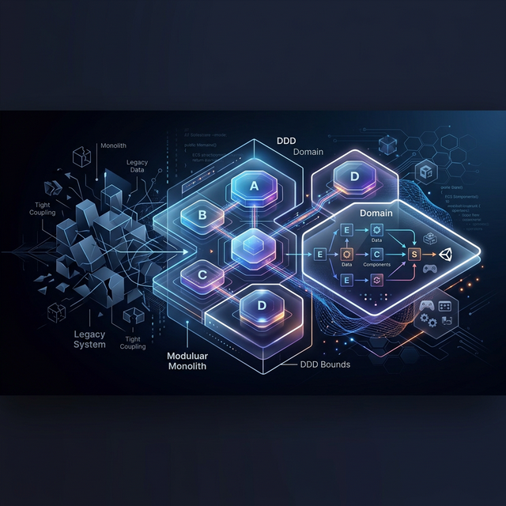

# Architect



게임과 웹앱 프로젝트를 위한 구조 설계, 마이그레이션 계획, 초기 스캐폴딩 자산을 제공하는 아키텍처 스킬 저장소입니다.

Architecture skill repository for project structure design, migration planning, and starter scaffolding across game and web-app projects.

## Why This Repo

- DDD-first project structure design for game and web-app projects
- Unity guidance with Outgame(DDD) / Ingame(ECS) separation
- UPM modularization and multiplayer Port/Adapter boundaries
- Planning augmentation, domain extraction, and migration task boards
- Platform-portable assets for Codex, Claude, and Antigravity

## Release

- Latest release: [v0.1.0](https://github.com/Hanjo92/Architect/releases/tag/v0.1.0)
- Changelog: [CHANGELOG.md](CHANGELOG.md)

## 포함 내용

- 스킬 본체: `skills/project-structure-design/SKILL.md`
- 보조 스킬: `skills/dependency-boundary-checker/SKILL.md`
- 참고 가이드: `skills/project-structure-design/references/`
- 실행 스크립트:
  - `skills/project-structure-design/scripts/generate_structure.py`
  - `skills/project-structure-design/scripts/validate_skill_integrity.py`
- 릴리즈 문서:
  - `CHANGELOG.md`
- 플랫폼 마이그레이션 문서 (`Platform/`):
  - 공통: `README.md`, `platform-migration-manifest.template.json`, `shared-migration-playbook.md`
  - Codex: `AGENTS.template.md`, `sample-output.md`, `validation.config.json` 등
  - Claude: `CLAUDE.md.template`, `system-prompt.template.md`, `example-usage.md` 등
  - Antigravity: `agent-config.template.yaml`, `prompt-pack.template.md`, `example-usage.md` 등
- 샘플 세트:
  - 공통: `skills/project-structure-design/samples/common-game/`
  - 캐주얼: `skills/project-structure-design/samples/casual-game/`
  - RPG: `skills/project-structure-design/samples/rpg-game/`
  - 포트/어댑터: `samples/unity-port-adapter/`

## 핵심 기능

- 게임: Outgame(DDD) / Ingame(ECS) 분리 설계
- Unity: UPM 모듈화(Ads/Achievements/Social) + Port/Adapter 경계
- 웹앱: DDD 기반 모듈 구조 제안
- 기획 문서 분석:
  - 빈약한 기획안 보강 제안
  - 다수 기획 문서 도메인별 정리
  - 도메인 추출 품질 게이트(신뢰도/근거) 적용
- 마이그레이션:
  - 플레이북 + 태스크 보드 기반 운영
- 경계 검증:
  - forbidden import / layer leak / module coupling 점검

## 빠른 사용

### 1) 스킬 호출

```text
[$project-structure-design](skills/project-structure-design/SKILL.md)
```

### 2) 폴더 구조 자동 생성

```bash
# Unity 캐주얼 + 멀티플레이
python3 skills/project-structure-design/scripts/generate_structure.py \
  --project-type game --unity --multiplayer --genre casual --output /path/to/project

# Unity RPG
python3 skills/project-structure-design/scripts/generate_structure.py \
  --project-type game --unity --genre rpg --output /path/to/project

# 웹앱
python3 skills/project-structure-design/scripts/generate_structure.py \
  --project-type webapp --output /path/to/project

# 웹앱 + 마이그레이션 스캐폴드
python3 skills/project-structure-design/scripts/generate_structure.py \
  --project-type webapp --with-migration-scaffold --output /path/to/project
```

`--dry-run` 옵션으로 생성 전 미리보기 가능합니다. `--with-migration-scaffold`를 추가하면 compatibility boundary, ambiguity register, subsystem classification, task board 문서가 함께 생성됩니다.

## 서브모듈로 사용

다른 프로젝트에서 이 저장소를 스킬 서브모듈로 붙여 재사용할 수 있습니다.

### 1) 서브모듈 추가

```bash
git submodule add https://github.com/Hanjo92/Architect.git tools/architect-skill
git submodule update --init --recursive
```

### 2) 대상 프로젝트 `AGENTS.md`에 스킬 등록

```md
## Skills

### Available skills
- project-structure-design: Design project structure and system architecture for game/web-app projects. Includes DDD/ECS split for games, Unity UPM modularization, planning augmentation, domain extraction, migration playbook/task board, and validation gates. (file: tools/architect-skill/skills/project-structure-design/SKILL.md)
```

### 3) 사용 예시

```text
[$project-structure-design](tools/architect-skill/skills/project-structure-design/SKILL.md)
이 프로젝트 구조 설계를 진행해줘.
```

이미 clone한 프로젝트에서 서브모듈만 받아오려면 아래 명령을 사용하면 됩니다.

```bash
git submodule update --init --recursive
```

## 검증

```bash
# 기본 검증
python3 "${CODEX_HOME:-$HOME/.codex}/skills/.system/skill-creator/scripts/quick_validate.py" \
  skills/project-structure-design

# 커스텀 무결성 검증
python3 skills/project-structure-design/scripts/validate_skill_integrity.py
```

## 기획 문서 입력 예시 프롬프트

아래 예시는 그대로 복붙해서 시작할 수 있습니다.

```text
[$project-structure-design](skills/project-structure-design/SKILL.md)
게임 기획 문서를 분석해서 도메인 추출, Outgame(DDD)/Ingame(ECS) 분리, 샘플 폴더 구조를 제안해줘.
문서:
- /path/docs/core-loop.md
- /path/docs/progression.md
- /path/docs/economy.md
출력은 Markdown + JSON 둘 다 제공해줘.
```

```text
[$project-structure-design](skills/project-structure-design/SKILL.md)
캐주얼 장르 기준으로 기획이 빈약한 부분을 가볍게 보강 제안하고,
도메인 신뢰도 점수/근거 링크를 포함한 구조 설계안을 만들어줘.
문서:
- /path/docs/overview.md
- /path/docs/stage-notes.md
```

```text
[$project-structure-design](skills/project-structure-design/SKILL.md)
RPG 장르 기준으로 Inventory/Equipment/Quest 중심으로 도메인 경계를 정리하고,
Unity UPM 분할안(com.company.game.*)까지 제안해줘.
문서:
- /path/docs/world.md
- /path/docs/combat.md
- /path/docs/quest.md
```

```text
[$project-structure-design](skills/project-structure-design/SKILL.md)
프로젝트 내 기획 문서가 많아. 먼저 도메인별로 문서를 정리하고 canonical 문서를 지정해줘.
그 다음 구조 설계안을 제안해줘.
문서 폴더:
- /path/docs/
```

```text
[$project-structure-design](skills/project-structure-design/SKILL.md)
기존 프로젝트를 신규 구조로 마이그레이션해야 해.
migration task board 템플릿 기반으로 태스크를 쪼개고 batch plan까지 제안해줘.
문서:
- /path/docs/current-architecture.md
- /path/docs/target-architecture.md
```

## 기본 스킬 등록

이 저장소는 루트 `AGENTS.md`에 `project-structure-design` 스킬이 등록되어 있습니다.
